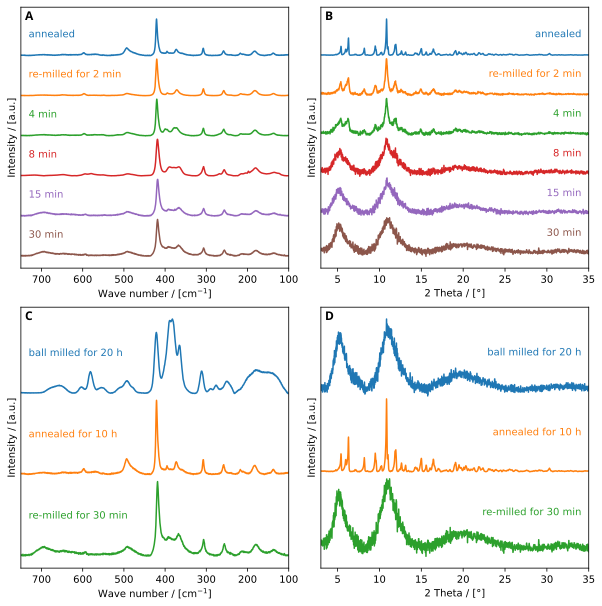

# FRED2Plot
FRamework for Experimental Data to Plot (FRED2Plot) 

## Description
The goal of the framework for experimental data to plot (FRED2Plot), is the automatical processing/ploting of XRD, PDF, NMR, Raman, FT-IR & electrochemical data inputs and, if wanted, uploading them to a [Kadi4mat](https://kadi.iam-cms.kit.edu/) instance.

## Project status
This project is still in development!

## Visuals
Examples of plots created with code snippets for my master thesis. After fixing the UI those scripts will be integrated in the Fred2plot software.


<br>



## Installation
All depending packages, needed to run those python scripts, are collected in the requirements.txt. To install them automatically just run the following command in your command line interface. 
Pip3 and Python3 has to be installed beforehand!

```
cd fred2plot
pip3 install -r requirements.txt
```

## Usage
Examples will follow once the user interface is fully functioning. Here is a small preview of the current state of the UI:


## Roadmap
- Integration of a UI made with TKinter
- Integration of all scripts into this UI
- Integration of Kadi4mat
- Integration of users (Kadi4mat)
- Integration of user collections and linking (Kadi4mat)

## Authors and acknowledgment
Main author: Adam Reupert

Thanks to [Stack Overflow](https://stackoverflow.com/). It helped me solving problems I even didn't know i had.

## License
[CC BY-NC](https://creativecommons.org/licenses/by-nc/4.0/legalcode) is applied for this project meaning you are free to share and adapt the material under the following terms:
- Attribution — You must give appropriate credit by referencing to this [project](https://github.com/adamreupert/fred2plot), provide a link to the [license](https://creativecommons.org/licenses/by-nc/4.0/legalcode), and indicate if changes were made. 
- NonCommercial — You may not use the material for commercial purposes. 

***
